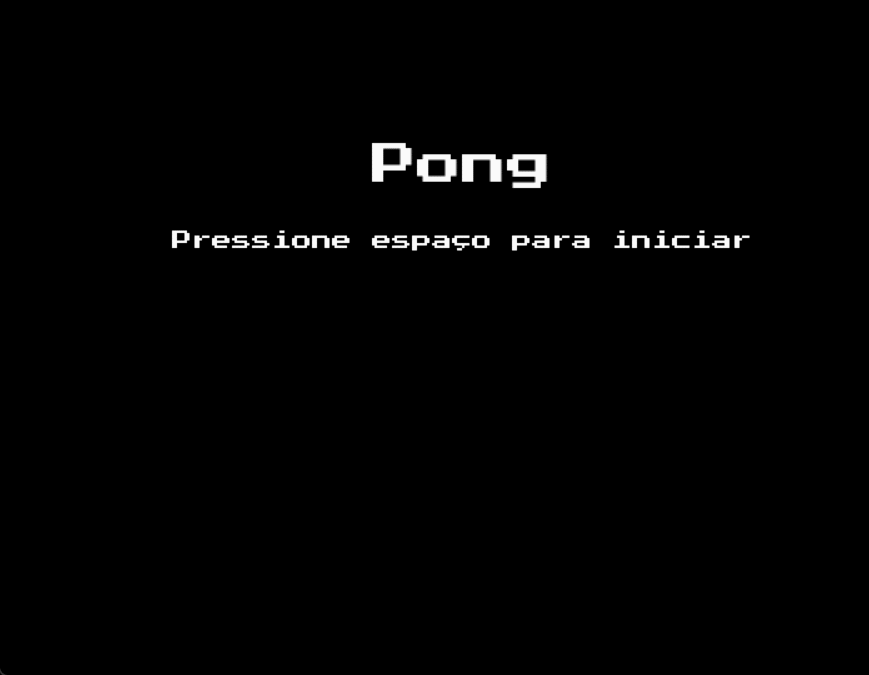

# pong_py

### Implementação simples do jogo Pong com a biblioteca PyGame

# Para instalar o pacote...

```bash
pip install -r requirements.txt
```

# Para executar o script do jogo:

```bash
python main.py
```

# Códigos com explicação
## Imports
```bash
import pygame
from pygame import mixer
import sys
```

Tamanho da tela:

```bash
  self.SCREEN_WIDTH = 800
  self.SCREEN_HEIGHT = 600
```

Tamanho das raquetes:
```bash
  self.PADDLE_WIDTH = 10
  self.PADDLE_HEIGHT = 60
```

Tamanho da bola:
```bash
  self.BALL_SIZE = 10
```

Jogadores:
```bash
  self.score_a = 0
  self.score_b = 0
```

Fonte de exibição:
```bash
  self.font_file = "font/PressStart2P-Regular.ttf"
  self.font = pygame.font.Font(self.font_file, 36)
```

Música e efeitos sonoros:
```bash
  self.mixer.music.load("audios/music_game.mp3")
  self.mixer.music.set_volume(0.3)
  self.mixer.music.play(-1)
  self.collision_sound_A = mixer.Sound("audios/Sound_A.wav")
  self.collision_sound_B = mixer.Sound("audios/Sound_B.wav")
  self.point_sound = mixer.Sound("audios/hoohooo.wav")
```

Definir o movimento das raquetes e a possição da bolinha no inicio do jogo:
Sendo que "paddle_a" raquete esquerda do jogador 1 e "paddle_b" raquete direita do jogador 2.
```bash
self.paddle_a = Paddle(20, self.SCREEN_HEIGHT // 2 - self.PADDLE_HEIGHT // 2, self.PADDLE_WIDTH, self.PADDLE_HEIGHT, self)
self.paddle_b = Paddle(self.SCREEN_WIDTH - 20 - self.PADDLE_WIDTH, self.SCREEN_HEIGHT // 2 - self.PADDLE_HEIGHT // 2, self.PADDLE_WIDTH, self.PADDLE_HEIGHT, self)
self.ball = Ball(self.SCREEN_WIDTH // 2 - self.BALL_SIZE // 2, self.SCREEN_HEIGHT // 2 - self.BALL_SIZE // 2, self.BALL_SIZE, self.BALL_SPEED, self.BALL_SPEED)
```

Movimento das raquetes:
Paddle A | Jogador 1

```bash
 # Movimento Vertical Paddle A
  if keys[pygame.K_w]:
      self.paddle_a.movey(-self.PADDLE_SPEED)
  if keys[pygame.K_s]:
    self.paddle_a.movey(self.PADDLE_SPEED)

  # Movimento Horizontal Paddle A
   if keys[pygame.K_a] and self.paddle_a.left > 0:
      self.paddle_a.movex(-self.PADDLE_SPEED)
   if keys[pygame.K_d] and self.paddle_a.right < self.SCREEN_WIDTH // 2 - 70:
      self.paddle_a.movex(self.PADDLE_SPEED)
```

Paddle B | Jogador 2

```bash
# Movimento Vertical Paddle B
   if keys[pygame.K_UP]:
     self.paddle_b.movey(-self.PADDLE_SPEED)
    if keys[pygame.K_DOWN]:
      self.paddle_b.movey(self.PADDLE_SPEED)

 # Movimento Horizontal Paddle B
    if keys[pygame.K_LEFT] and self.paddle_b.left > self.SCREEN_WIDTH // 2 + 70:
       self.paddle_b.movex(-self.PADDLE_SPEED)
    if keys[pygame.K_RIGHT] and self.paddle_b.right < self.SCREEN_WIDTH:
       self.paddle_b.movex(self.PADDLE_SPEED)
```

Atualização da posição da bola:

```bash
    self.ball.move()

            if self.ball.colliderect(self.paddle_a):
                self.ball.left = self.paddle_a.right
                self.ball.reverse_dx()
                self.collision_sound_A.play()

            elif self.ball.colliderect(self.paddle_b):
                self.ball.right = self.paddle_b.left
                self.ball.reverse_dx()
                self.collision_sound_B.play()
```

Bola bate em cima e embaixo:
```bash
 if self.ball.top <= 0 or self.ball.bottom >= self.SCREEN_HEIGHT:
    self.ball.reverse_dy()
```

Fazer o placar e depois atualiza a tela:
```bash
if self.ball.left <= 0:
    self.score_b += 1
    self.reset_ball()
    self.point_sound.play()
    if self.score_b == 10:
       self.end_game(False)

elif self.ball.right >= self.SCREEN_WIDTH:
    self.score_a += 1
    self.reset_ball()
    self.point_sound.play()
    if self.score_a == 10:
       self.end_game(True)

self.score_text = self.font.render(f"{self.score_a}  {self.score_b}", True, self.WHITE)
self.score_rect = self.score_text.get_rect(center=(self.SCREEN_WIDTH // 2, 30))
self.screen.blit(self.score_text, self.score_rect)
```

Atualiza a tela:
```bash
pygame.display.flip()
```

Mostrando o resultado final na tela com a música:

```bash
    def end_game(self, winner):
        while True:
            for self.event in pygame.event.get():
                if self.handle_events(self.reset_game):
                    return
             
    # Renderização da tela de fim de jogo
       self.mixer.music.stop()
       self.screen.fill(self.BLACK)
       if winner:
         self.winner_text = "Player 2 Wins!"
       else:
         self.inner_text = "Player 1 Wins!"

       self.winner_font = pygame.font.Font(self.font_file, 36)
       self.winner_render = self.winner_font.render(self.winner_text, True, self.WHITE)
       self.winner_rect = self.winner_render.get_rect(center=(self.SCREEN_WIDTH // 2, self.SCREEN_HEIGHT // 4))
       self.screen.blit(self.winner_render, self.winner_rect)
       pygame.display.flip()


```

# Para jogar:

Escolha o seu adversário;
Dê o play no canto superior à direita;
Aperte o espaço para iniciar o jogo;
No teclado ultilize esses botões:
| Jogador 1 | Jogador 2 |
| --- | --- |
| W: para cima | ⬆️: para cima |
| S: para baixo | ⬇️: para baixo |



